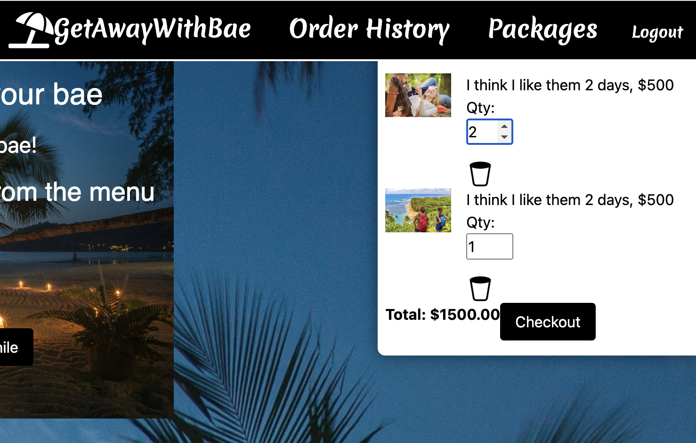
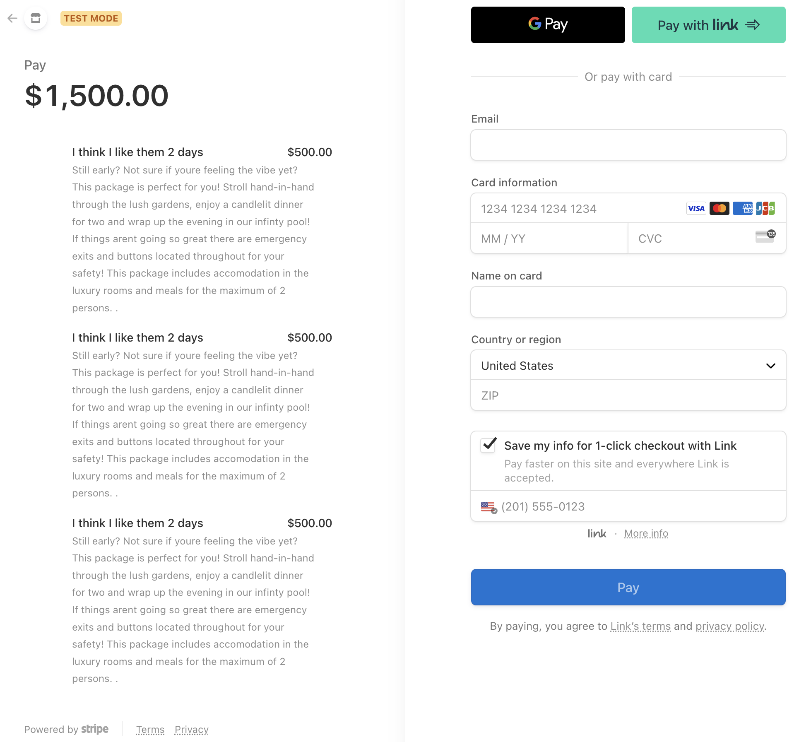

# GetAwayWithBae

 

## Description
🌴 Escape to Paradise with Our Ultimate Get Away With Bae Application! 🌴

You've worked so hard for the past 6 months and you deserve a break, a getaway! Well, look no further, we present to you [Get Away With Bae](https://fierce-tundra-81897.herokuapp.com). This website is designed to take the work out of planning your tropical vacation. Take a look at our packages and let us take you away. Customers can start with creating an account where they can save their vacation selections and safely make purchases. To view our website, please click [Get Away With Bae](https://fierce-tundra-81897.herokuapp.com).
 Curious developers can also view our GitHub repository at https://github.com/LondaNH/Iheartmusic

## Table of Contents 

- [Installation](#installation)
- [Technologies](#technologies)
- [Contributors](#contributors)
- [Usage](#usage)
- [License](#license)
- [Questions](#questions)

## Technologies
The following technologies were used to create our application: 
- MERN Stack (MondoDB, ExpressJS, React, NodeJS)
- GraphQL
- Apollo
- Stripe

## Installation

    npm i  
    npm run seed  
    npm run develop  

## Contributors
- Ellie Hess

- Hussien Rizk 

- Beatriz Rivard 

- Londa N. 

- Joycell Johnson 

## Usage 
When you come to our webpage, users will be greeted with our homepage:

Users will then need to create an account. Our application will save and encrypt your credentials for future reference. 

Please note that users are encouraged to continue using our services. Simply log back into your account.

Once logged in, you will have the options to explore packages, view order history or logout.

You can also view your cart.

And you can finally make a purchase.

## License

This project is covered under the MIT license. To learn more about what this means, click the license button at the top.

## Questions 

Any questions? Feel free to reach out to us:

- <b>Ellie Hess - elhess03@gmail.com (https://github.com/elliehess)</b>

- <b> Hussien Rizk  - hussrizk56@gmail.com (https://github.com/hussrizk56)</b>

- <b>Beatriz Rivard - beatrizfreire182@gmail.com (https://github.com/Beatriz-Rivard)</b>

- <b>Londa N. - Kacku807@gmail.com (https://github.com/LondaNH)</b>

- <b>Joycell Johnson - JRJ20716@gmail.com (https://github.com/Joy-Johns)</b>
